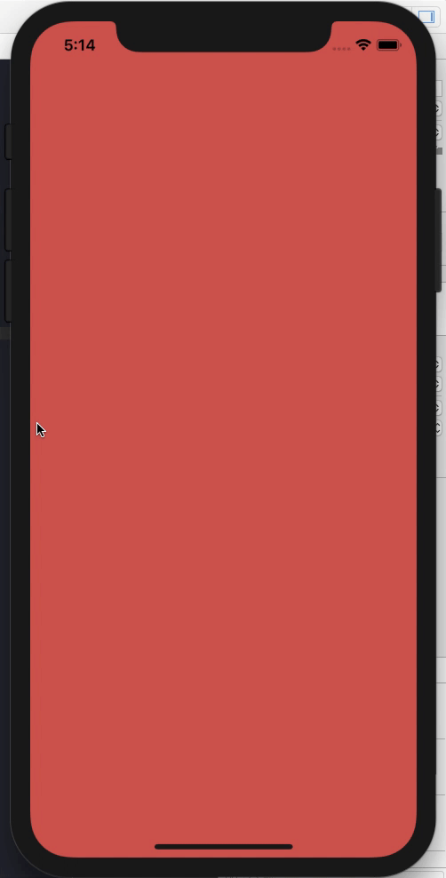

模仿小米的返回按钮



## 使用

````swift
class ViewController: UIViewController,MIBackGestureRecognizerProtocol {

    override func viewDidLoad() {
        
        super.viewDidLoad()
        
        self.miBackInitialization()
    }

    func miBackDidBack() {
        
        self.dismiss(animated: true, completion: nil)
    }
}
````